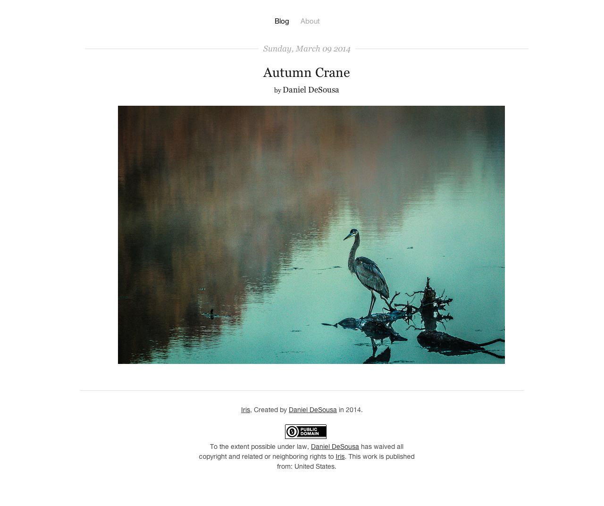

pelican-iris
============

Minimalist pelican theme for readability and photo blogs.

This theme is under active development and may change substantially.

## Features

Iris supports a number of features, including:

- Google Analytics tracking.
- Favicon and Apple Touch Icon support.
- Beautiful javascript driven photo galleries with Galleria.
- Freely distributable and modifiable worldwide.
- More features being adding regularly!

## Screenshot(s)

Or see it in action [at my blog](http://dandesousa.com)

## Template Variables

The following template variables exist, and can be used to manipulate the look and feel of the template:

| Variable | Options | Description | Examples |
| -------- | ------- | ----------- | -------- |
| IRIS_HIDE_COPYRIGHT | True, False | If true, hides the public domain notice at the bottom of each page. | IRIS_HIDE_COPYRIGHT = True |
| IRIS_FAV_ICON | any text | Set to the path on your page to the favicon.ico file to site for your site. This should also be set in your STATIC_PATHS list in pelicanconf.py. | IRIS_FAV_ICON = 'favicon.ico' |
| IRIS_IOS_ICON_PREFIX | any text | Set to the base path of your apple-touch-icons for you site. This will enable iOS touch icons for book marks on all iOS platforms if you specify files of the following format: {{ IRIS_IOS_ICON_PREFIX }}-57x57.png. Repeat for sizes 57, 72, 114, 120, 152 to enable support on all iOS platforms. These images should also be set in your STATIC_PATHS list in pelicanconf.py | IRIS_IOS_ICON_PREFIX = 'apple-touch-icon' |
| IRIS_IOS_ICON_PRECOMPOSED | True, False | Set to True if you want your icons to be precomposed, or without extra styling applied on those platforms that support additional styling. | IRIS_IOS_ICON_PRECOMPOSED = True |
| IRIS_DISABLE_ARTICLE_LINKS | True, False | Set to True if you want to create a tumbler style blog with no article specific links crawlable from the main site | IRIS_DISABLE_ARTICLE_LINKS = True |
| IRIS_DISABLE_AUTHOR_LINKS | True, False | Set to True if you want to disable links to the author page | IRIS_DISABLE_AUTHOR_LINKS = False |
| IRIS_DISABLE_GALLERIA | True, False | If true, stops gallaria javascript from loading in the browser. Useful it want to disable photo galleries and save some load times | IRIS_DISABLE_GALLERIA = True |
| GOOGLE_ANALYTICS | google analytics id | Set this to your google analytics id for google analytics tracking | GOOGLE_ANALYTICS = 'UA-XXXXXXX-X' |

## License

 
To the extent possible under law,
<a rel="dct:publisher" href="dandesousa.com/about">Daniel DeSousa</a>
has waived all copyright and related or neighboring rights to
<a href="http://github.com/dandesousa/pelican-iris">Iris</a>.
This work is published from:

    United States.

